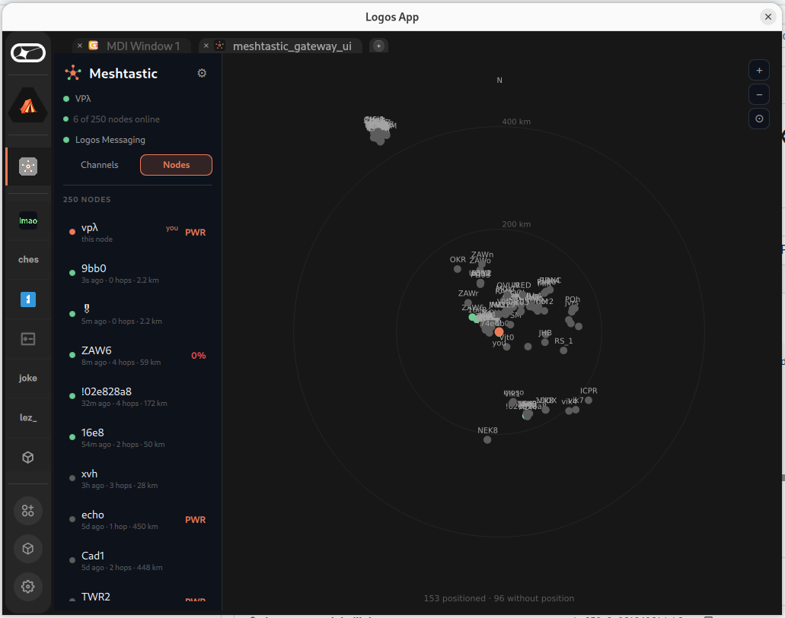
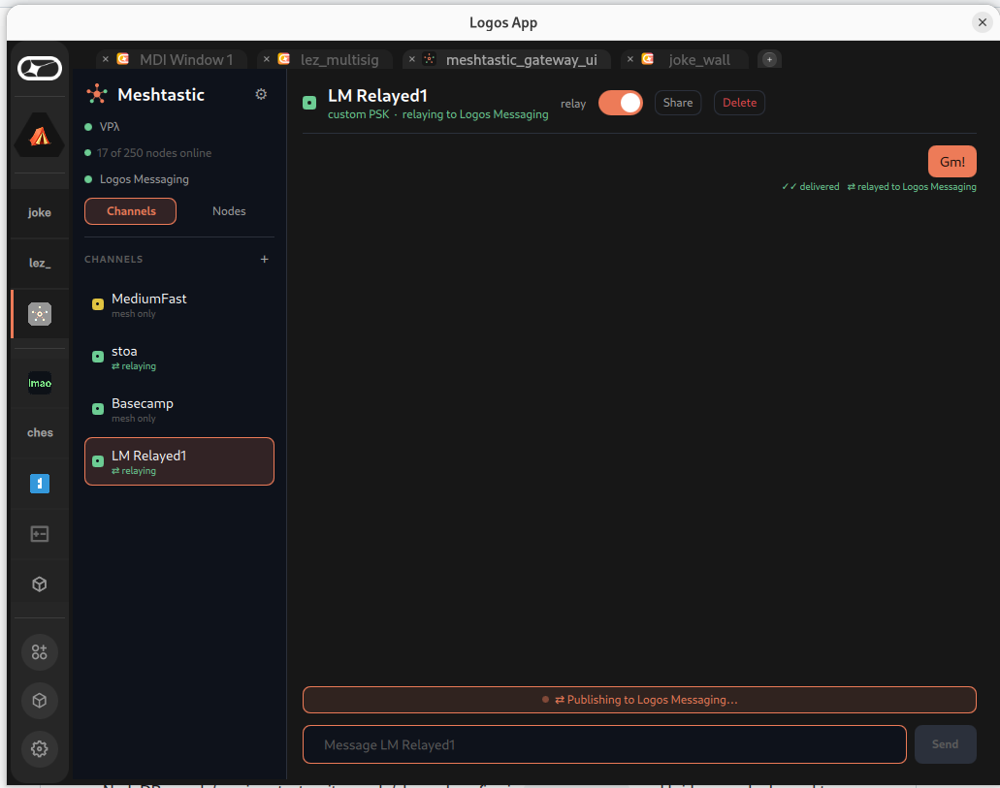
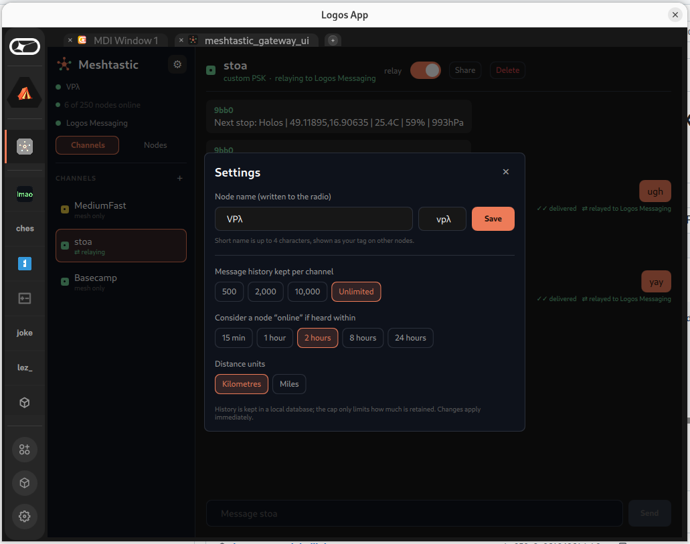

# basecamp-meshtastic

Logos Basecamp modules that bridge a **Meshtastic LoRa** mesh ⇄ **Logos Messaging (Delivery / Waku)** —
chat from a Basecamp UI and have it reach (and come back from) the mesh, with a per-channel opt-in relay
to the internet over Logos Messaging.

## Modules

- **`gateway/`** — `mesh_gateway` (`core`, C++): talks to a USB-attached Meshtastic node over the
  native **StreamAPI** (QtSerialPort + meshtastic protobufs generated at build time). It reads the
  node's channels and NodeDB, sends/receives text, writes node/channel config via `AdminMessage`, and
  bridges each channel to a Logos Messaging content topic via `delivery_module` (Logos Core IPC). Chat
  history, relay preferences and settings persist in **SQLite**. Degrades gracefully with no radio.
- **`ui/`** — `mesh_gateway_ui` (`ui_qml`): the desktop UI. Fully **signal-driven** — it never
  blocks on IPC; the backend pushes state via events and the UI renders from them.

The UI depends on `mesh_gateway` and `qr`; the gateway depends on `delivery_module` (stock). Each
channel maps to a content topic `md5(name+psk)[:16]` (or `md5("idx:N")` when unnamed) →
`/meshtastic/1/<hash>/proto`, so only holders of the channel name+PSK can compute it.

## Features

- **Chat** per channel — sender names, delivery/ack ticks, emoji reactions, relay/origin tags.
- **Per-channel relay** to Logos Messaging (opt-in; loop-prevented — see [`DATAFLOWS.md`](DATAFLOWS.md)).
- **Nodes** view — full NodeDB (battery, SNR, hops, last-heard, hardware, position) with a relative-plot
  **map** (peers by distance + bearing from your node, range rings, zoom) and a detail panel.
- **Channel management** — create, delete, and **share** (a real `meshtastic.org/e/#…` URL + scannable
  **QR**, generated by the [`qr`](https://github.com/xAlisher/qr-basecamp) module).
- **Node config** — set the node's owner name from the UI (via `AdminMessage`).
- **Settings** — message-retention cap, "online" activity window, distance units (km/mi).

## Screenshots

**Nodes & map** — the mesh NodeDB with a relative-plot map (peers by distance + bearing, range rings, zoom):



**Channels & relay** — a channel bridged to Logos Messaging (here the public `LM Relayed1` test channel):



**Settings** — node name, history retention, "online" window, units; per-channel relay toggle + share:



## Install

You need **Basecamp** and a **Meshtastic node connected over USB**. Install the two dependencies first,
then the app (open the UI last — it auto-loads its dependencies):

1. **`delivery_module`** (Logos Messaging) — install from Basecamp's **Package Manager**; it's a stock
   Logos Core module.
2. **`qr`** (QR generator service) — download **`logos-qr-module-lib.lgx`** from
   [qr-basecamp releases](https://github.com/xAlisher/qr-basecamp/releases/latest) and install it.
   (Only the core service is needed — you can skip `qr_ui`.)
3. **Meshtastic Gateway** — from the
   [latest release](https://github.com/vpavlin/basecamp-meshtastic/releases/latest), download the **core**
   (`…mesh_gateway-module-lib…`) and **UI** (`…mesh_gateway_ui-module…`) `.lgx`, picking the
   asset for your architecture (**`-linux-amd64`** for a PC, **`-linux-arm64`** for a Raspberry Pi), then
   install both.

Then open **Meshtastic Gateway** from Basecamp's app list — it pulls in `delivery_module` and `qr`
automatically.

> Installing a downloaded `.lgx`: use Basecamp's Package Manager (install from file), or the `lgpm` CLI:
> `lgpm install --file <file>.lgx`.

**Notes**

- On Linux your user must be allowed to open the serial device (e.g. be in the `dialout` group for
  `/dev/ttyACM*`). Set `MESHTASTIC_DEV=/dev/...` to force a specific device.
- Only **one** application can hold the radio at a time. If another app — or a second Basecamp — has the
  serial port open, the gateway sits at "connecting" and grabs the port automatically once it's freed.

## Try it — public test channel

To see the bridge work without setting up your own channel, join the public **`LM Relayed1`** test
channel (already relayed to Logos Messaging):

**<https://meshtastic.org/e/#Ch8SEC1G1oGFGJgmvH4qBCfYzSgaC0xNIFJlbGF5ZWQx>**

Open that link on a Meshtastic device (or paste it into the Meshtastic app / scan it as a QR) to add the
channel, then pick it in the gateway. Messages on it bridge to Logos Messaging, so two people far apart —
each with their own node — can chat through it. It's a **shared, public** channel for testing; don't send
anything you wouldn't post publicly.

## Headless / server relay (no GUI)

The relay logic lives in the **core** module, so it can run as an always-on service on a server or
Raspberry Pi with **no UI and no laptop** — via `logoscore`, the GUI-less Logos host. Set which channels
to bridge once (persisted), and a systemd service keeps it relaying. See **[`server/`](server/)** for the
systemd unit, an installer, and `gwctl` (configure relay channels / settings without the UI), plus the
Raspberry Pi (aarch64) notes.

## Build from source

```bash
cd gateway && nix build .#lgx-portable   # -> result/*.lgx (core module)
cd ../ui   && nix build .#lgx-portable   # -> result/*.lgx (ui_qml plugin)
```

CI builds both on every `v*` tag and attaches the `.lgx` files to a GitHub Release — see
[`.github/workflows/release.yml`](.github/workflows/release.yml).

## Security

- **LoRa:** Meshtastic encrypts on-air with the channel PSK; the radio decrypts before handing messages
  to the gateway over USB (no crypto in the gateway on the mesh side).
- **Logos Messaging relay:** the relayed payload is **AES-256-GCM encrypted** with a key derived from
  the channel PSK — `SHA-256("mesh-gateway/lm-relay/v1\n" + psk)`. The derivation is deterministic,
  so every member (who already shares the channel name + PSK) computes the same key and can decrypt, while
  a network observer on the Waku content topic sees only ciphertext. So a **private channel stays private
  end to end**. Channels with no PSK are relayed in plaintext (they're unencrypted on LoRa too).
- The content topic itself is derived from the channel name + PSK (`md5(name+psk)`), so non-members can't
  even find a channel's messages.

## Notes

- **Privacy:** relay is opt-in per channel and **channel 0 (the public/default channel) is never
  auto-relayed**; the primary channel can't be deleted.
- A blank primary channel is shown by its LoRa modem preset (e.g. *MediumFast*), matching Meshtastic
  clients.
